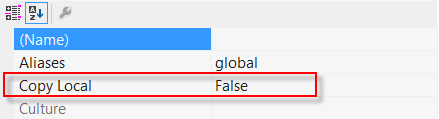

# CodexLib
A shared library

How to add to your project
-----------
* Add CodexLib reference to your project.
* Important! Set local copy to <b>false</b>. Manual copy CodexLib.dll into your mod folder. \

* In your entry method, make sure to call EnsureCodexLib() like so:
```csharp
public static bool Load(UnityModManager.ModEntry modEntry)
{
    try
    {
        EnsureCodexLib(modEntry.Path);
        [...]
        return true;
    }
    catch (Exception ex)
    {
        return false;
    }
}

private static void EnsureCodexLib(string modPath)
{
    if (AppDomain.CurrentDomain.GetAssemblies().Any(a => a.FullName.StartsWith("CodexLib, ")))
    {
        Console.WriteLine("CodexLib already loaded.");
        return;
    }

    string path = null;
    Version version = null;
    modPath = new DirectoryInfo(modPath).Parent.FullName;
    Console.WriteLine("Looking for CodexLib in " + modPath);

    foreach (string cPath in Directory.GetFiles(modPath, "CodexLib.dll", SearchOption.AllDirectories))
    {
        try
        {
            var cVersion = new Version(FileVersionInfo.GetVersionInfo(cPath).FileVersion);
            Console.WriteLine($"Found: newer={version == null || cVersion > version} version={cVersion} @ {cPath}");
            if (version == null || cVersion > version)
            {
                path = cPath;
                version = cVersion;
            }
        }
        catch (Exception) { }
    }

    if (path != null)
    {
        try
        {
            Print("Loading CodexLib " + path);
            AppDomain.CurrentDomain.Load(File.ReadAllBytes(path));
        }
        catch (Exception) { }
    }
}
```
* Important! Before patching blueprints set the scope to your project. This is where guids will be resolved. If you use CodexLib's components, you should also run MasterPatch.
```csharp
using var scope = new Scope(modPath: Main.ModPath, logger: Main.logger, harmony: Main.harmony, allowGuidGeneration: false);
MasterPatch.Run();
```
* Important! If you generate GUIDs make sure you only do so on your machine! Make sure allowGuidGeneration is false when publishing your mod. I suggest using compiler instructions like. "#if DEBUG"

Things to note
-----------
* This assembly will only be loaded once. Only the most recent assembly should be loaded. Which is why you must set local copy to false.
* Failure to comply will potentially crash other mods using this library or cause bugs.
* Method signatures should not changed during versions. If there is a major change, you will need to recompile your project.
* I will usually keep original method signatures for a while and mark them as obsolete. Check your compiler warnings.
* PS: I plan to rework or remove the ToRef methods.
* I recommend to NOT use ILMerge or ILRepack on CodexLib. If you merge the assemblies, it will isolate your instance of CodexLib. This will prevent potential update issues, but also cause unexpected behaviour. It blocks all cross mod compatability, may cause issues with deserialization in save data, and some components might not work. Specifically these that require Harmony patches to work. You must not use MasterPatch.Run() when merging assemblies. Otherwise you will call the patches in your instance and cause bugs with other mods using CodexLib.

